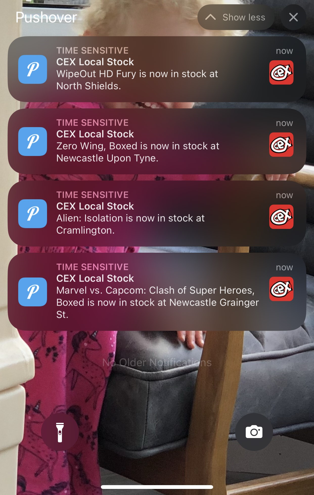
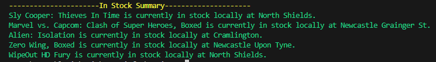

# CEX Local Stock Checker
PowerShell script to check specific stores for specific stock and can send a notification to your device using Pushover
https://pushover.net/

[What is Pushover and how do I use it?](https://support.pushover.net/i7-what-is-pushover-and-how-do-i-use-it)



And to get a summary of what is in stock and where locally



This script uses three .txt files as a "database" for reviewing what items you want reviewed, what stores to check and when to notify as stock is available or removed. There is an optional fourth file to sending summary notifications of all your wanted items that are in stock.

## Example setups
It is advised to use this script on a schedule to be automatically alerted when stock is changed for your chosen item. Three examples are provided in this repo;

- [Kubernetes CronJob](kubernetes-deployments/cex-local-store-checker.yml)
- [Windows Task Scheduler](windows-task-scheduler-example/CEXLocalStoreCheck.xml)
- [Github Action](.github/workflows/stockcheck.yml)

The Powershell script has seven parameters;

|  Parameter | Mandatory  |  Example | Notes  |   
|---|---|---|---|
|  ItemsToCheckFilePath |  Y |  ./items-to-check.txt |   |   
|  Latitude | Y  | 54.974758  | https://www.latlong.net/  |   
|  Longitude | Y  | -1.620000  | https://www.latlong.net/  |   
|  StoresToCheckFilePath | Y  |  ./stores-to-check.txt |   |   
|  PushoverToken | N  | aab2nv99jg36mgtrgju29gdmji768o3  | https://pushover.net  |   
|  PushoverUser |  N |  uzdp9r5qsg5uwla1ua5gviyy17j2so |  https://pushover.net |   
|  SendSummaryNotificationOn |  N |  Tuesday, Friday | |   


## ItemsToCheckFilePath
You need to input the ID's of the items you want to check. This is found in the URL of the item

 

an example file is provided in this repo.

## Latitude & Longitude
You can get these using https://www.latlong.net/. This is your address. 

## StoresToCheckFilePath
You need to input the store names as they are from the CEX database. These can be found using the search function on the site.


An example file has been provided in this repo.

## PushoverToken & PushoverUser
If you want to be alerted when stock is changed, this script uses Pushover. Set this up and input your token and user IDs. The script will only notify on changes in stock and not every time the script is run.

# SendSummaryNotificationOn
You can send a summary of everything that is in stock for the items you're following if you so choose, input the days you want the notification to send. there will be an additional txt file created to check if the notification has already been sent and erase it on non wanted days.

# Example run
Example run in Powershell

```pwsh
. '.\CEXLocalStoreCheck.ps1' -ItemsToCheckFilePath .\items-to-check.txt -Latitude "54.974758" -Longitude "-1.620000" -StoresToCheckFilePath .\stores-to-check.txt -PushoverToken "aab2nv99jguojhgfhj29gdmjiyx5o3" -PushoverUser "uzdp3zaqsg5uxfpoiuytviyyq4j2so" -SendSummaryNotificationOn Tuesday, Friday 
```
